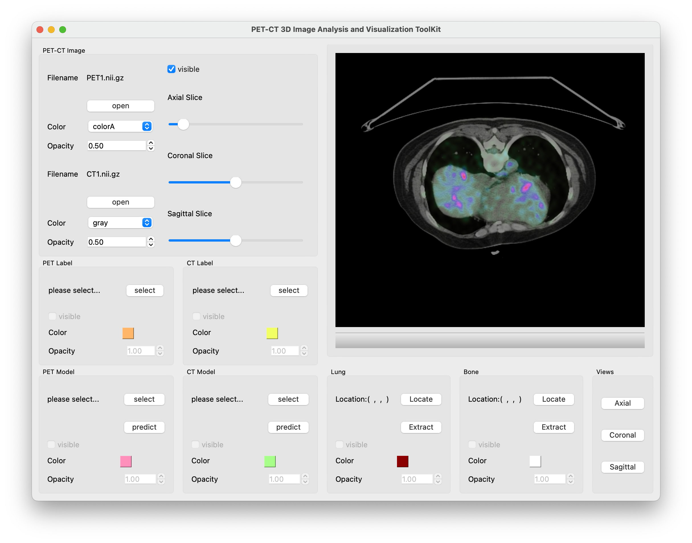
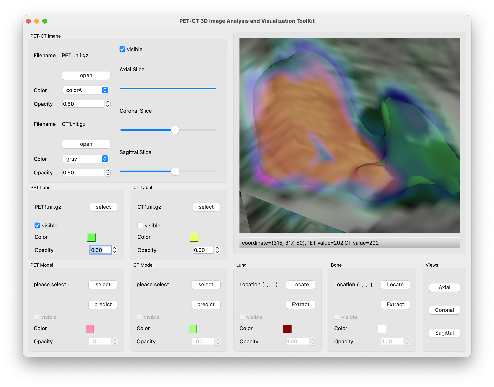
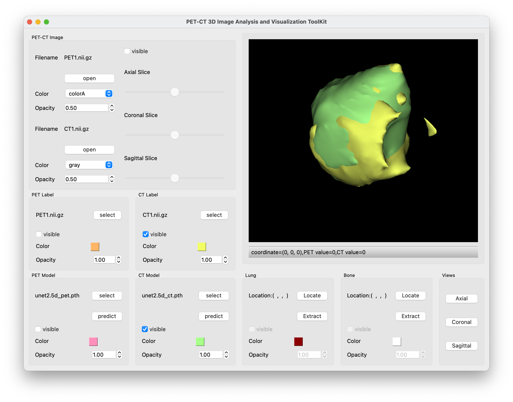
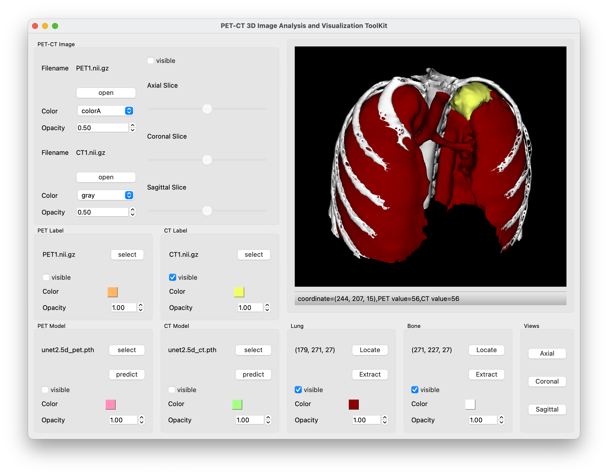

This is a GUI software system for the processing and visualization of PET-CT images, and is mainly developed based on PyQt5, VTK, MONAI, Pytorch.  
# Functions
3D PET-CT volumes are visualized in the form of 2D slices, and the users can change the display range of slices by dragging the slider.  
  
3D PET labels and CT labels are visualized by means of surface rendering.  
  
Modality-specific segmentation of lung tumors in PET-CT images is performed based on deep learning model, and the segmentation result is also visualized by means of surface rendering.  
  
Interactive segmentation of lung and bone in CT image based on region growing algorithm is also integrated. 
  
# Intereseted?
This project was developed when the author was studying at Soochow University and was supported by Jiangsu Students’ Innovation and Entrepreneurship Training Program (202110285115Y). The copyright of this project belongs to Soochow University, so this project is only for display and ***the source code won't be uploaded.***  
But, if you appreciate my work, please pay attention to my other projects, because ***I will upload several simple but useful demos and docs***, which doesn't infringe copyright but will be of assistance to you.  

